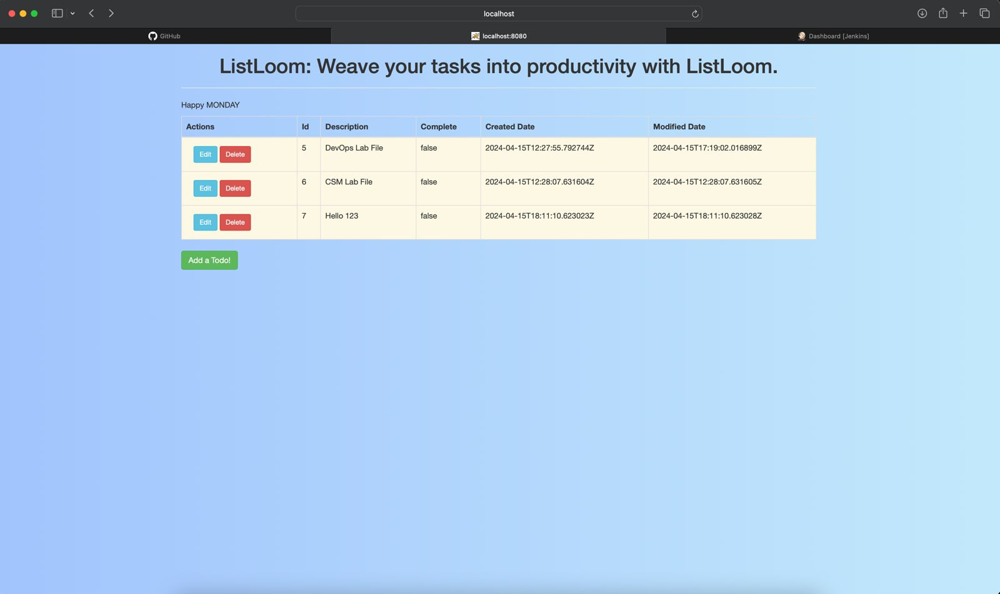

# Spring Boot Todo Application: ListLoom

Welcome to ListLoom, a comprehensive Todo Application built with Java Spring Boot. This application is designed to help you manage your tasks efficiently, providing a simple yet powerful interface for adding, updating, and deleting todo items.

## Features

- **Todo Management**: Easily add, update, and delete todo items.
- **Database Integration**: Uses Spring Data JPA for database operations, ensuring data persistence.
- **Web Interface**: A user-friendly web interface for managing your todos.
- **Testing Support**: Comes with a robust testing setup, including unit, integration, and web layer tests.

## Getting Started

To get started with ListLoom, follow these simple steps:

1. Clone the repository:

- `git clone repository-link`
- `cd ListLoom`
- open in favorite editor, or
- `./mvnw clean install`
- `./mvnw spring-boot:run`
- open http://localhost:8080 and TODO away!

This will run all unit, integration, and web layer tests, ensuring that the application behaves as expected.

## Contributing

We welcome contributions from the community! If you're interested in contributing to ListLoom, please follow these steps:

1. Fork the repository.
2. Create a new branch for your feature or bugfix.
3. Make your changes and commit them to your branch.
4. Open a pull request with a detailed description of your changes.

## Contact

If you have any questions or feedback, please feel free to reach out to us.

Thank you for using ListLoom!